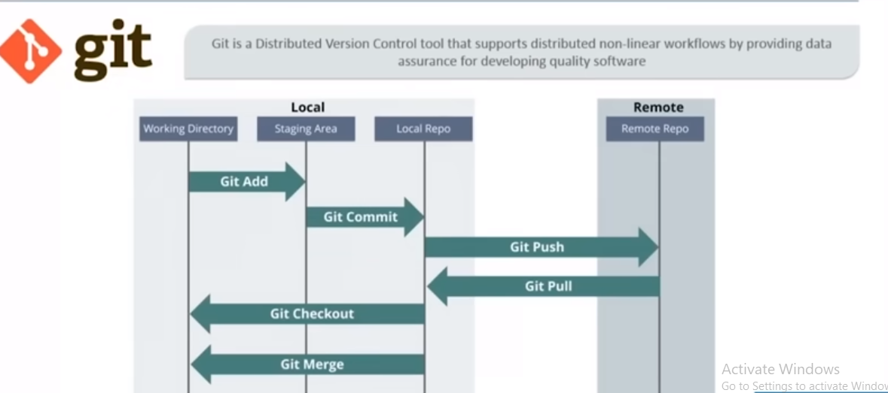

# Learn git and github Basic
Learning GitHub is a great way to improve your skills as a developer, collaborate with other developers on open source projects.

## Architecture

## Where i start to learn git and github
# Steps 
- A repository is a place where you can store and manage your code. 
- You can create a repository on GitHub and upload your code to it. GitHub provides an easy-to-use interface for managing your repository and collaborating with others.

# Use this command for upload project on it
- Open Git Bash: Open Git Bash on your computer.
- Navigate to your project directory: Use the cd command to navigate to your project's root directory.
-- cd path/to/your/project

- Initialize Git (if you haven't already): Initialize a new Git repository in your project directory by running:
-- git init

- Add your files: Add all your project files to the staging area:
-- git add .

- Commit your changes: Commit the added files with a descriptive message:
-- git commit -m "Initial commit"
  
- Create a new repository on GitHub: Go to GitHub and create a new repository.Do not initialize it with a README, .gitignore, or license.

- Add the remote repository: Add the URL of the GitHub repository you just created as a remote repository:
-- git remote add origin https://github.com/yourusername/yourrepository.git
 // Replace https://github.com/yourusername/yourrepository.git with the actual URL of your GitHub repository.

- Push your project to GitHub: Push your local repository to GitHub:
-- git push -u origin master
or try
-- git pull --rebase origin master

## Push Your Code to GitHub:
Push your committed changes to the remote repository:
git push -u origin master
Push Your Code to GitHub:
## Push your committed changes to the remote repository and set the upstream branch to main:
git branch -M main
git push -u origin main

## Check Your Git Configuration:
Ensure your Git configuration is set to the correct user. Run the following commands to set your Git user name and email:

git config --global user.name "kolipratibha"
git config --global user.email "kolipratibha2002@gmail.com"

## If error is occured like 
Computer Point@DESKTOP-7FAA7R6 MINGW64 /d/A_DevOps/CodeNode/Project_Registration (main)
$ git push -u origin main
To https://github.com/KoliPratibha8902/nodejsproject_demo.git
 ! [rejected]        main -> main (fetch first)
error: failed to push some refs to 'https://github.com/KoliPratibha8902/nodejsproject_demo.git'
hint: Updates were rejected because the remote contains work that you do
hint: not have locally. This is usually caused by another repository pushing
hint: to the same ref. You may want to first integrate the remote changes
hint: (e.g., 'git pull ...') before pushing again.
hint: See the 'Note about fast-forwards' in 'git push --help' for details.

Computer Point@DESKTOP-7FAA7R6 MINGW64 /d/A_DevOps/CodeNode/Project_Registration (main)
## use this $ git pull --rebase origin main
remote: Enumerating objects: 3, done.
remote: Counting objects: 100% (3/3), done.
remote: Compressing objects: 100% (2/2), done.
remote: Total 3 (delta 0), reused 0 (delta 0), pack-reused 0
Unpacking objects: 100% (3/3), 932 bytes | 8.00 KiB/s, done.
From https://github.com/KoliPratibha8902/nodejsproject_demo
 * branch            main       -> FETCH_HEAD
 * [new branch]      main       -> origin/main
Successfully rebased and updated refs/heads/main.

